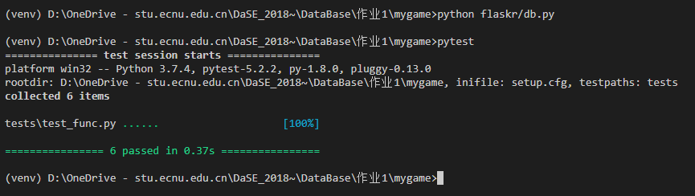

# Treasure Hunt! @基于mongoDB的实现

## 代码组织

- 文件目录：

  |——flaskr

  ​		|————\_init\_.py

  ​		|————app.py

  ​		|————db.py

  ​		|————func.py

  |——tests

  ​		|————\_init\_.py

  ​		|————conftest.py

  ​		|————test_func.py

  |——venv

  |——README.md

- 自定义的函数：

| 函数接口               | 作用                                      |
| ---------------------- | ----------------------------------------- |
| GetU(usr_name, attri); | 获取用户某属性                            |
| GetTr(tr_name, attri); | 获取宝物某属性                            |
| dump(CLT);             | 保存表格当前状态                          |
| reset(CLT);            | 清空某表（如market）                      |
| recycle(name);         | 当用户储存箱已满时，回收最低价值的宝物    |
| tomorrow();            | 时间流逝，每天刷新用户可工作/可寻宝的状态 |

- url接口函数：

| url                                       | function              |
| ----------------------------------------- | --------------------- |
| try/<string:name>                         | login(name)；         |
| try/<string:name>/explore                 | explore(name);        |
| try/<string:name>/wear/<string:tr_name>   | wear(name,tr_name);   |
| try/<string:name>/unwear/<string:tr_name> | unwear(name,tr_name); |
| try/<string:name>/sale/<string:tr_name>   | sale(name,tr_name);   |
| try/<string:name>/unsale/<string:tr_name> | unsale(name,tr_name); |

- test函数：

| 函数接口             | 测试功能       |
| -------------------- | -------------- |
| test_work            | 赚钱           |
| test_explore         | 寻宝           |
| test_wear            | 穿戴装备       |
| test_unwear          | 脱下装备       |
| test_sale_and_unsale | 售卖、取消售卖 |
| test_buy             | 购买           |

