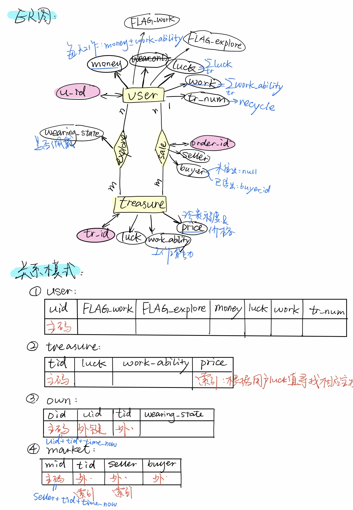

# Treasure Hunt! @基于flask-sqlAlchemy的实现
考虑以下游戏场景：
1.	每个游戏玩家都有一定数量的金币、宝物。有一个市场供玩家们买卖宝物。玩家可以将宝物放到市场上挂牌，自己确定价格。其他玩家支付足够的金币，可购买宝物。
2.	宝物分为两类：一类为工具，它决定持有玩家的工作能力；一类为配饰，它决定持有玩家的运气。
3.	每位玩家每天可以通过寻宝获得一件宝物，宝物的价值由玩家的运气决定。每位玩家每天可以通过劳动赚取金币，赚得多少由玩家的工作能力决定。（游戏中的一天可以是现实中的1分钟、5分钟、10分钟。自主设定。）
4.	每个宝物都有一个自己的名字（尽量不重复）。每位玩家能够佩戴的宝物是有限的（比如一个玩家只能佩戴一个工具和两个配饰）。多余的宝物被放在存储箱中，不起作用，但可以拿到市场出售。
5.	在市场上挂牌的宝物必须在存储箱中并仍然在存储箱中，直到宝物被卖出。挂牌的宝物可以被收回，并以新的价格重新挂牌。当存储箱装不下时，运气或工作能力值最低的宝物将被系统自动回收。
6.	假设游戏永不停止而玩家的最终目的是获得最好的宝物。

请根据以上场景构建一个假想的Web游戏，可供多人在线上玩耍。界面尽可能简单（简单文字和链接即可，不需要style）。后台的数据库使用postgresql。对游戏玩家提供以下几种操作：寻宝（可以自动每天一次）、赚钱（可以自动每天一次）、佩戴宝物、浏览市场、买宝物、挂牌宝物、收回宝物。

提交：程序+文档
要求：

1.	文档主要用于解释你的数据库设计；画出ER图，从ER图衍生出关系模式；然后对关系模式进行优化，说明需要构建哪些索引，以及应用访问数据库的SQL指令。
2.	为玩家的操作设计JSON HTTP协议的接口，自定义接口格式（request和response的JSON）；为每个接口编写测试用例和测试代码。
3.	不限制编程语言及web框架。

## 代码组织

- 文件目录：

  |—flaskr/

  |————\_init\_.py							创建db、bp；initialize tables；另起线程实现“每天”的流逝

  |————models.py						定义了数据库schema

  |————create_db.py 				  初始化数据库表中用户、宝物等数据，建立初始状态

  |————func.py							 用户功能的实现

  |—tests/

  |————\_init\_.py

  |————conftest.py					 定义client

  |————test_func.py				   测试用户功能

  |—venv/										  环境

  |—README.md

- 自定义的函数：

| 函数接口               | 作用                                      |
| ---------------------- | ----------------------------------------- |
| GetU(usr_name, attri); | 获取用户某属性                            |
| GetTr(tr_name, attri); | 获取宝物某属性                            |
| dump(CLT);             | 保存表格当前状态                          |
| reset(CLT);            | 清空某表（如market）                      |
| recycle(name);         | 当用户储存箱已满时，回收最低价值的宝物    |
| tomorrow();            | 时间流逝，每天刷新用户可工作/可寻宝的状态 |

- url接口函数*：

| url                                       | function              |
| ----------------------------------------- | --------------------- |
| try/<string:name>                         | login(name)；         |
| try/<string:name>/explore                 | explore(name);        |
| try/<string:name>/wear/<string:tr_name>   | wear(name,tr_name);   |
| try/<string:name>/unwear/<string:tr_name> | unwear(name,tr_name); |
| try/<string:name>/sale/<string:tr_name>   | sale(name,tr_name);   |
| try/<string:name>/unsale/<string:tr_name> | unsale(name,tr_name); |

- test函数：

| 函数接口             | 测试功能       |
| -------------------- | -------------- |
| test_work            | 赚钱           |
| test_explore         | 寻宝           |
| test_wear            | 穿戴装备       |
| test_unwear          | 脱下装备       |
| test_sale_and_unsale | 售卖、取消售卖 |
| test_buy             | 购买           |

**功能实现的具体细节见代码详细注释。*

## 数据库设计（示意）

## 测试结果：

1. 运行db.py创建/初始化数据库；
2. pytest自动检测test_开头的测试文件，共6个测试函数全部通过。

## 一些心得体会:

